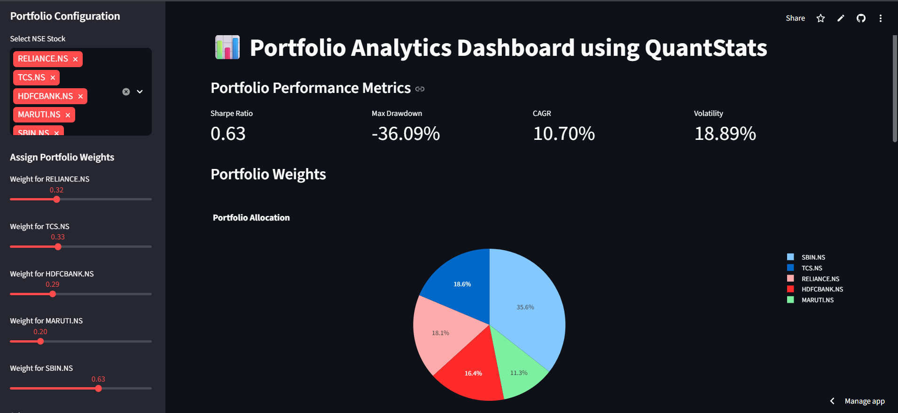
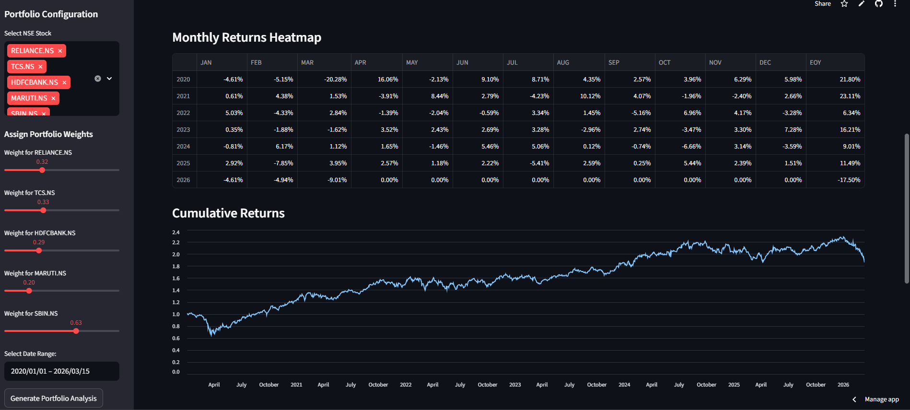
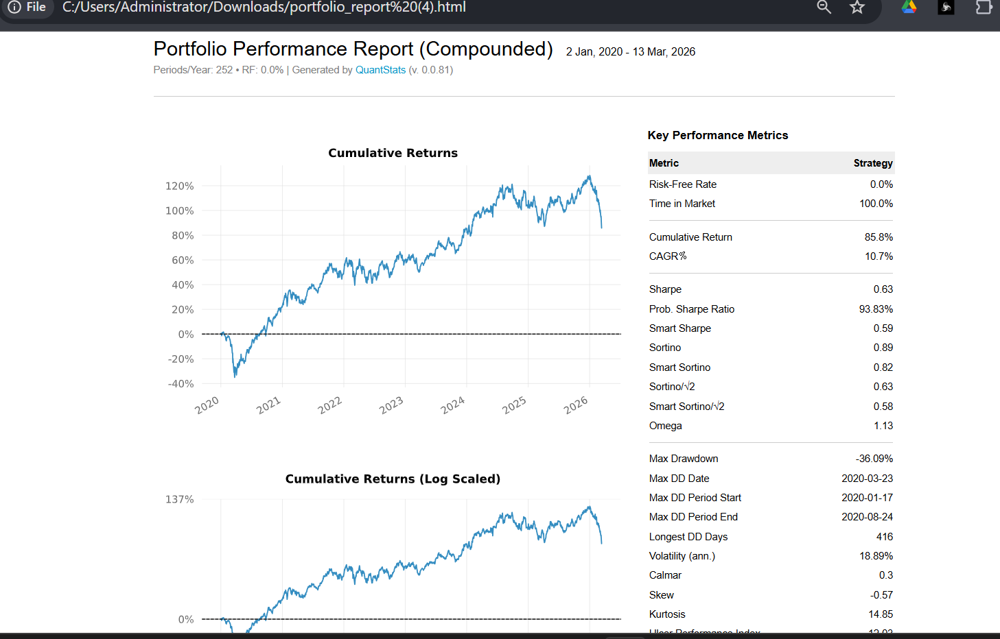

Portfolio_Dashboard
 Portfolio Analytics Dashboard using QuantStats

-A Streamlit-based dashboard that allows users to build custom equity portfolios using NSE-listed stocks and analyze performance using QuantStats, YFinance, and Plotly.
-This tool fetches historical market data, computes returns, and generates professional-grade analytics including Sharpe Ratio, CAGR, Volatility, Drawdowns, heatmaps, cumulative charts, and a downloadable performance report.

 Features

- Select multiple NSE stocks from a curated list
- Assign portfolio weights dynamically
- Auto-normalization of weights to sum to 1
- Fetches price data using Yahoo Finance
- Computes key performance metrics:
  Sharpe Ratio
  Max Drawdown
  CAGR
  Volatility

- Visualizations using Plotly & Streamlit:
  Allocation pie chart
  Monthly return heatmap
  Cumulative returns
  End-of-year returns distribution

Generates QuantStats HTML performance report for download

## Screenshots

### Portfolio Allocation

### Cumulative Returns & Monthly Heatmap

### QuantStats Report

