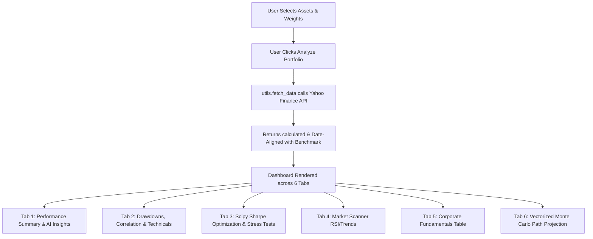

# 📊 Project Analysis: Pro Portfolio Analytics Dashboard

This report provides a detailed, end-to-end breakdown of the **Pro Portfolio Analytics** project, analyzing its architecture, core components, financial computations, data flows, and design.

---

## 1. Project Purpose
The **Pro Portfolio Analytics Dashboard** is a comprehensive financial decision-making tool built for retail and institutional investors. Its primary purpose is to allow users to build, backtest, stress-test, optimize, and scan equity portfolios. By leveraging historical stock price data, technical indicators, and modern portfolio theory (MPT), the application provides actionable insights, automated allocation optimizations, and risk estimations.

---

## 2. Tech Stack Used
*   **Core Logic & Analytics**: Python 3.12
*   **UI Framework**: Streamlit (for building interactive web interfaces)
*   **Financial & Statistical Data APIs**: Yahoo Finance API (`yfinance`)
*   **Financial Metrics & Analytics Library**: `quantstats`
*   **Optimization & Scientific Calculations**: `scipy` (specifically `scipy.optimize`), `numpy`
*   **Data Manipulation**: `pandas`
*   **Data Visualization**: Plotly Express & Plotly Graph Objects (`plotly`)

---

## 3. Reorganized Folder Structure
After the reorganization, the project follows clean software architecture standards:

```
c:\Users\Administrator\Desktop\project_1\
├── src/                          # Main Application Source Code
│   ├── dash.py                   # Main Streamlit UI Entrypoint & Page Layout
│   ├── utils.py                  # Financial Algorithms, API Requests & Calculations
│   └── charts.py                 # Plotly Visualization Plotting Functions
├── tests/                        # Benchmarking & Validation Scripts
│   ├── debug_mc.py               # Monte Carlo Simulation Performance Benchmark
│   └── debug_test.py             # Data Fetching & Optimization CLI Test
├── requirements.txt              # Project Library Dependencies
└── assets/                       # Static Assets & Styling Resources
```

---

## 4. Main Python Files & Functionality

### 1. [dash.py](file:///c:/Users/Administrator/Desktop/project_1/src/dash.py)
This is the central entry point of the Streamlit application. It handles:
*   Global web app page config and styling through custom CSS injection.
*   Application session state initialization for caching downloaded metrics.
*   The Sidebar user input panel (asset selector, weight sliders, date input, analyze button, HTML report download).
*   Multitabbing layout to structure various subviews (Overview, Deep Dive, AI Advisor, Market Scanner, Fundamentals, Monte Carlo).

### 2. [utils.py](file:///c:/Users/Administrator/Desktop/project_1/src/utils.py)
Contains the backend analytical and data-fetching logic:
*   `fetch_data`: downloads historical price data from Yahoo Finance.
*   `get_fundamentals`: pulls stock metrics like Market Cap, sector, and ratios.
*   `calculate_portfolio_returns`: computes weighted returns.
*   `run_monte_carlo`: projects portfolio growth pathways using vectorized geometric brownian motion/normal returns generation.
*   `optimize_portfolio`: solves the Maximum Sharpe Ratio weight allocation using Scipy's SLSQP algorithm.
*   `generate_insights`: outputs text-based portfolio evaluations.
*   `scan_market` / `calculate_technical_signals`: computes RSI, trend indicators, and signal rationale.

### 3. [charts.py](file:///c:/Users/Administrator/Desktop/project_1/src/charts.py)
Dedicated charting library encapsulating all visualization logic:
*   `plot_interactive_chart`: plots line charts for prices or returns, with optional SMA/EMA overlays.
*   `plot_correlation_matrix`: renders a heat map of asset correlations.
*   `plot_monte_carlo`: visualizes 100 sample simulated paths alongside the mean projection path.
*   `plot_drawdown`: renders an area chart showing historical drawdown percentage.

---

## 5. End-to-End Application Flow



---

## 6. Data Source & Processing
*   **Data Source**: Yahoo Finance API accessed via `yfinance` library.
*   **Download Phase**: Fetches historical closing prices for selected stock tickers and benchmarks based on the user-selected date range.
*   **Alignment & Normalization Phase**:
    1.  Computes daily percent change (`pct_change()`).
    2.  Removes missing values (`dropna()`).
    3.  Multiplies returns by weights and sums across columns to obtain unified daily portfolio return series.
    4.  Intersects dates to align benchmarks exactly with the assets' active trading dates.

---

## 7. Financial Metrics & Calculation Methods

| Metric | Calculation Library / Logic | Math/Method Description |
| :--- | :--- | :--- |
| **Sharpe Ratio** | `quantstats` (`qs.stats.sharpe`) | Annualized average excess return divided by annualized volatility of daily returns. |
| **CAGR (Compound Annual Growth Rate)** | `quantstats` (`qs.stats.cagr`) | The geometric average rate of return over the years. |
| **Volatility** | `quantstats` (`qs.stats.volatility`) | Annualized standard deviation of daily returns. |
| **Max Drawdown** | `quantstats` (`qs.stats.max_drawdown`) | The maximum peak-to-trough drop in cumulative performance. |
| **Asset Correlation** | `pandas` / `charts.py` | Pearson correlation coefficient matrix of asset returns. |
| **Technical Indicators** | Custom in `utils.py` | 14-period RSI (gain/loss average ratio), 50-period SMA, 200-period SMA. |

---

## 8. Known Limitations or Bugs
1.  **Duplicate Code in [utils.py](file:///c:/Users/Administrator/Desktop/project_1/src/utils.py)**: The functions `fetch_market_data`, `calculate_technical_signals`, and `scan_market` are defined twice inside the file (Lines 121-220 and 222-322).
2.  **No Risk-Free Rate Config**: The Sharpe optimization currently defaults to a 0% risk-free rate and does not let the user customize this value.
3.  **Stress Test Limitation**: If a user runs a stress test (e.g. 2008 Financial Crisis) containing stocks listed *after* 2009, the download fails or returns empty datasets.
4.  **No Caching for Technical Views**: Changing technical view parameters causes a full streamlit page rerun.

---

## 9. Architectural Overview
The project is built on the **Model-View-Presenter / Modular** paradigm.
*   **View**: `dash.py` acts as the rendering controller presenting HTML and Plotly assets to the screen.
*   **Presenter / Data Layer**: `utils.py` manages requests, caches data in memory using Streamlit's `@st.cache_data`, and executes financial algorithms.
*   **Visual Elements**: `charts.py` decouples UI structure from design templates by serving clean, pre-styled Dark-Theme Plotly charts.

---

## 10. Suggestions for Future Improvements
1.  **Eliminate Redundancy**: Remove the duplicate function declarations in `utils.py`.
2.  **Adaptive Date Boundaries in Stress Tests**: Automatically filter out or alert users about assets that were not listed during historical stress periods instead of throwing errors.
3.  **Custom Risk-Free Rate Selection**: Introduce a sidebar slider for the risk-free rate (e.g., matching the current government bond yield) to enhance Sharpe calculation accuracy.
4.  **Efficient Vectorized Backtesting**: Integrate `quantstats` HTML reporting inside tab elements rather than requiring a raw file download.
